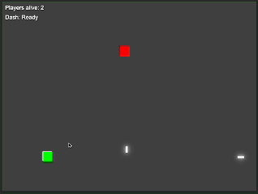

# Peel Peel Battle - Multiplayer Game

Um jogo multiplayer de batalha onde jogadores duelam usando projéteis em um mapa com obstáculos.


## Instalação e Execução

1. Clone o repositório:
```bash
git clone https://github.com/seu-usuario/peel-peel-battle.git
cd peel-peel-battle
```

2. Instale as dependências:
```bash
npm install
```

3. Inicie o servidor:
```bash
node server.js
```

## Configurando o Dev Tunnel no VS Code

1. Abra o VS Code na pasta do projeto
2. Clique no ícone "Remote Explorer" na barra lateral
3. Na seção "Dev Tunnels", clique em "Create A Tunnel"
4. Escolha um nome para seu túnel
5. Selecione "Port" e insira 3000
6. Escolha "Public" para visibilidade
7. Clique em "Create"
8. Clique com o botão direito no túnel e selecione "Start Tunnel"
9. Copie a URL do túnel (será algo como: `https://seu-tunel.devtunnels.ms`)
10. No arquivo `index.html`, atualize a URL do WebSocket:
```javascript
const ws = new WebSocket('wss://seu-tunel.devtunnels.ms');
```

## Jogando

1. Compartilhe o link do seu túnel com outros jogadores
2. Cada jogador deve abrir o arquivo `index.html` em seu navegador

### Controles
- WASD ou setas para movimento em todas as direções
- Clique do mouse para atirar (mira em 360°)
- Evite projéteis inimigos e use as paredes como cobertura

## Troubleshooting

Se o jogo não conectar:
- Verifique se o servidor está rodando (`node server.js`)
- Confirme se o túnel está ativo no VS Code
- Verifique se a URL do WebSocket está correta no `index.html`

## Notas

- O túnel do VS Code tem limites de banda e conexões
- Para melhor experiência, todos os jogadores devem ter uma conexão estável
- O último jogador vivo vence a rodada
- O jogo reinicia automaticamente quando sobra apenas um jogador

## Tecnologias

- Node.js
- WebSocket (ws)
- HTML5
- JavaScript